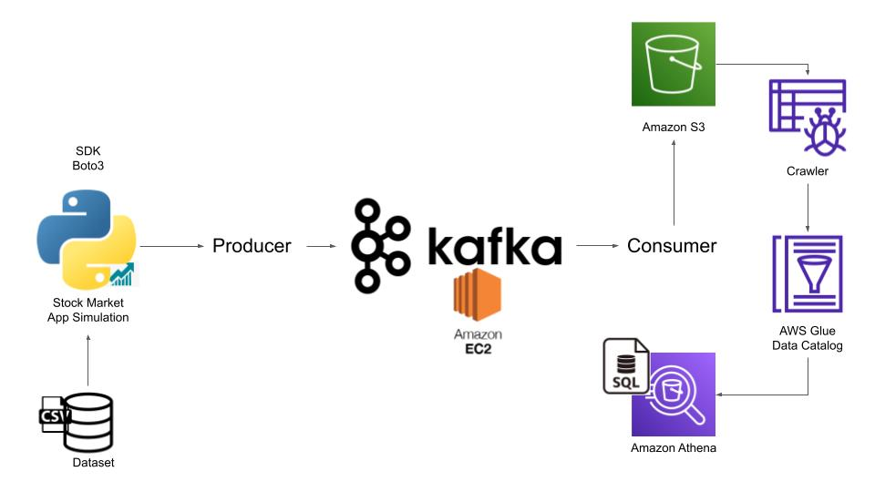

# 📊 Real-Time Stock Market Data Pipeline using Kafka & AWS

## Overview
This project implements a real-time data engineering pipeline that simulates stock market data streaming using Apache Kafka and AWS cloud services. The system ingests stock data from a CSV dataset, streams it through Kafka, stores it in Amazon S3, and enables SQL-based analysis using AWS Glue and Amazon Athena.

---

## Architecture

  CSV Dataset → Kafka Producer → Kafka Broker → Kafka Consumer → Amazon S3 → AWS Glue → Amazon Athena

---

## ⚙️ Technologies Used

- **Python** (Pandas, Kafka-Python, Boto3)
- **Apache Kafka** (Real-time streaming)
- **Amazon EC2** (Kafka deployment)
- **Amazon S3** (Data Lake storage)
- **AWS Glue** (Schema detection & catalog)
- **Amazon Athena** (SQL-based querying)

---

## 🔄 Workflow

1. **Data Ingestion**
   - Load stock dataset (`CSV`) using Pandas.

2. **Data Streaming**
   - Producer sends data row-by-row to Kafka topic.

3. **Message Processing**
   - Kafka broker manages real-time data flow.

4. **Data Consumption**
   - Consumer reads messages from Kafka.

5. **Data Storage**
   - Data stored in Amazon S3 as JSON files.

6. **Schema Detection**
   - AWS Glue crawler infers schema and creates tables.

7. **Data Analysis**
   - Athena queries data using SQL.

---

##  How to Run

### Step 1: Start Kafka Services on EC2

Navigate to Kafka directory and start Zookeeper

cd kafka_2.13-3.7.0  
bin/zookeeper-server-start.sh config/zookeeper.properties  

Open a new terminal and start Kafka broker 

cd kafka_2.13-3.7.0  
export KAFKA_HEAP_OPTS="-Xmx256M -Xms128M"  
bin/kafka-server-start.sh config/server.properties  

---

### Step 2: Run Consumer

Run the consumer first so it starts listening for incoming data  
python3 consumer/consumer.py  

---

### Step 3: Run Producer

Run the producer to start streaming stock data  
python3 producer/producer.py

 ---
 
## 🧾 Code Implementation

Producer Logic: producer/producer.py  
Consumer Logic: consumer/consumer.py

---

## Sample Query (Athena)

Example SQL query used to analyze the stored stock market data:

SELECT * FROM stock_db LIMIT 10;

---

## ⭐ Features

• Real-time data streaming using Apache Kafka  
• Scalable cloud storage using Amazon S3  
• Automated schema detection using AWS Glue  
• Serverless SQL analytics using Amazon Athena  
• End-to-end data engineering pipeline

---

#### Important Notes

• AWS credentials and .pem files are not included for security reasons  
• A sample dataset is used instead of the full dataset  
• Real-time streaming is simulated using historical data  
